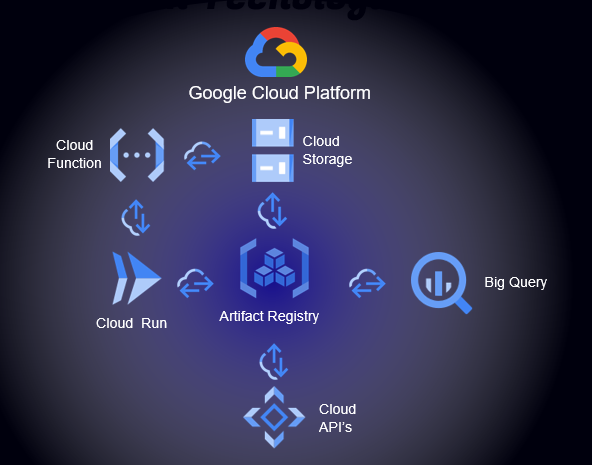

### 1. Configuración de GCP:

#### a. Crear Proyecto:

- Definir nombre y region del proyecto.

#### b. Configuración del proyecto:

- habilitar las APIS: 
  
  - Geocoding API
  - Cloud Functions API
  - Cloud Pub/Sub API
  - Eventarc API
  - Artifact Registry API
  - Cloud Logging API
  - Cloud Run Admin API
  - BigQuery API
  - Cloud Build API
  - Cloud Dataplex API
  - Service Usage API
  - Analytics Hub API
  - BigQuery Connection API
  - BigQuery Data Policy API
  - BigQuery Migration API
  - BigQuery Reservation API
  - BigQuery Storage API
  - Cloud Datastore API
  - Cloud Monitoring API
  - Cloud SQL
  - Cloud Storage
  - Cloud Storage AP
  - Cloud Trace API
  - Container Registry API
  - Dataform API
  - Google Cloud APIs
  - Google Cloud Storage JSON API
  - Legacy Cloud Source Repositories
  - Service Management API 

- Cloud Storage
  
  - Creamos el Bucket donde se almacenaran los datos crudos.
  - Creamos el Bucket donde se almacenara el resultado del ETL.

- Credenciales:
  
  - Agregamos los roles necesarios a la cuenta de servicios 'Default compute service account':
    
    - Administrador de objetos de Storage
    
    - Editor
    
    - Editor de datos de BigQuery
    
    - Invocador de Cloud Run
    
    - Receptor de eventos de Eventarc
    
    - Usuario de trabajo de BigQuery

#### c. Bigquery

- Creamos un conjunto de datos la nombramos y seleccionamos la region.
  - Creamos una tabla.
    - Seleccionamos el Proyecto y conjuno de datos de destino.
    - Nombramos la tabla
    - Cargamos las columnas y tipos de datos necesarios.

#### d. Cloud Function:

- Creamos una funcion:
- - Nombramos y elegimos la region.
  - Configuramos los Workers (CPU, RAM, Instancias)
- Configuramos Entorno de Ejecución
  - Seleccionamos el entorno con el lenguaje deseado en este caso Python 3.11.
  - Completamos el archivo 'main.py' con la logica para el ETL.
  - Completamos el archivo 'requeriments.txt' con las librerias necesarias.
  - Porbamos la ejecucion de la función e implementamos.

#### Proceso Flujo de datos:

Al momento de realizar la carga del archivo al ***Cloud Storage*** , ***Cloud Fuction*** genera un evento con los datos de este archivo, quien llama a ***Cloud Run***, este levanta un contenedor alojado en ***Artifact Registry*** donde ejecuta la logica de la funcion con los datos del evento abriendo el archivo del cloud estorage, realizando las transformaciones y obteniendo los datos geograficos de la ***Geocoding API***, una vez finalizado las tareas realiza la carga a la base de datos de ***Big Query***.

[Logica ETL](https://github.com/HotelWise/HotelWise/blob/ELT-Google/main.py)

[Requerimientos](https://github.com/HotelWise/HotelWise/blob/ELT-Google/requirements.txt)

[EDA](https://github.com/HotelWise/HotelWise/blob/ELT-Google/Notebooks/EDA_PF.ipynb)
